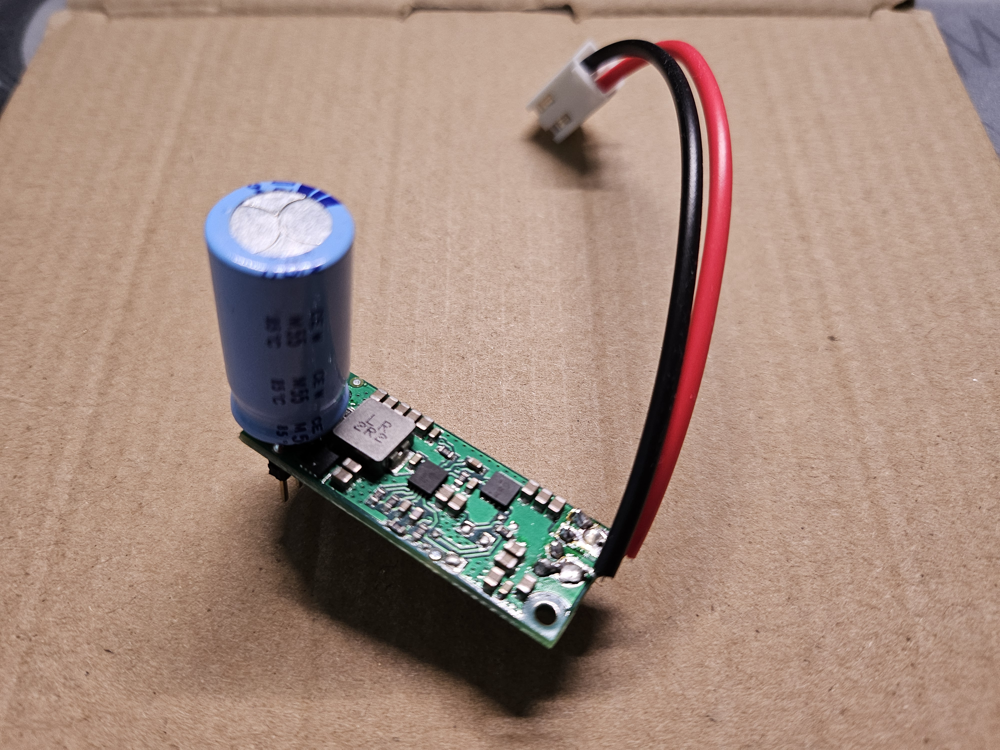

# Projet PAMI (2025-2026) - Eurobot

Ce dépôt documente le projet PAMI (Petit Actionneur Motorisé Indépendant) sur lequel j'ai travaillé pendant un an, dans le cadre de la coupe Eurobot 2026. Il centralise l'ensemble de la conception matérielle (deux PCB, structure mécanique) et logicielle du robot. 

## Codes principaux

Pour mieux comprendre l'architecture du système, voici les trois éléments importants du dépôt :

*   **[`PAMI_2026/`](./Projects/PAMI_2026)** : Contient le code haut niveau qui est exécuté sur le microcontrôleur **ESP32**.
*   **[`Projects/Asservissement_G4/`](./Projects/Asservissement_G4)** : Contient tout le code de l'asservissement, de l'odométrie et le contrôle des moteurs. Ce code tourne sur la carte **NUCLEO-G431KB** (STM32).
*   **[`Projects/IHM_PAMI_2026.py`](./Projects/IHM_PAMI_2026.py)** : Une interface homme-machine (IHM) développée en Python qui permet de lire et visualiser en temps réel les coordonnées et l'état du PAMI lors des phases de tests.

---

## ⚙️ Architecture Bas Niveau : PCB Principal (Contrôle Moteurs & Alimentation)

Le robot dispose de deux cartes électroniques (PCB). La partie bas niveau, gérée par le PCB s'occupe de l'alimentation générale et de la motricité du robot. Le PAMI est assez compact : ses dimensions finales sont de 10.5cm par 19cm avec ses bras repliés (et 24cm bras dépliés), ce qui a imposé des contraintes sur le routage du circuit et le choix des composants.

### 1. Gestion de la Batterie et Alimentation
Le robot est alimenté par une unique cellule de batterie LiFePO4 au format 26650. Le circuit d'alimentation a subi plusieurs modifications suite à des problèmes rencontrés lors du développement :

*   **Circuit de Charge :** La charge est gérée directement sur le PCB par un composant dédié à ce type de batterie, le **CN3058E**, avec des LEDs indicatrices (Charge en cours / Charge terminée).
*   **Sécurité Batterie :** La batterie est surveillée par un IC de protection **HY2112**, associé à un double MOSFET N-Channel (FS8205A) pour couper le circuit en cas de problème.
*   **Régulation de tension :** La tension de la cellule LiFePO4 pouvant monter à 3.6V (ce qui est trop élevé pour l'ESP32 et certains capteurs), j'ai opté pour un convertisseur **Buck-Boost (TPS63000)** au lieu d'un simple circuit Boost. Il assure un 3.3V parfaitement stable en abaissant ou élevant la tension de la batterie selon les besoins, pour un courant jusqu'à 1A.
*   **Le problème des appels de courant :** Un problème est survenu avec l'alimentation des servomoteurs. Leurs appels de courant créaient d'énormes chutes de tension (la tension de la batterie chutait jusqu'à 2.4V pendant un court instant). Le robot ne parvenait pas à se lever de manière autonome, la tension de la batterie passait en dessous du seuil limite du circuit boost 6V. La résistance interne du boitier de la batterie 26650 et des pistes de cuivre trop fines (1.5mm) qui ne supportaient pas les pics d'intensité très élevés (pouvant monter jusqu'à 3A sur le rail 6V, soit quasiment 6A en sortie de la batterie). Le problème a été résolu en soudant un condensateur de 2200µF (10V) directement à l'entrée du boost 6V pour agir comme une réserve d'énergie, ce qui diminuait fortement la chute de tension.

### 2. Odométrie, Moteurs et NUCLEO-G431KB
La carte intègre un microcontrôleur STM32 (NUCLEO-G431KB) pour gérer la dynamique du robot.

*   **Pilotage Moteurs :** Deux moteurs à courant continu sont pilotés par deux drivers moteurs. Des tests ont montré une consommation de 70mA à vide et jusqu'à 500mA si les roues sont bloquées.
*   **Odométrie :** Les encodeurs des roues renvoient des signaux en quadrature qui sont décodés par la carte (via des timers dédiés de la STM32). À pleine vitesse, les moteurs tournent à une vitesse d'environ 5 tr/s, soit une vitesse de déplacement du robot de 68 cm/s (2.4 km/h). La dérive de l'odométrie (calcul des coordonnées en temps réel) est estimée à environ 2cm pour 1m parcourue en linéaire. L'erreur angulaire quand à elle était très variable en fonction de l'état de la surface du terrain (poussière, terrain lisse) à cause du patinage du robot qui pouvait avoir lieu.
*   **Communication Inter-Cartes :** Le STM32 transmet continuellement ses données d'odométrie et ses statuts au second microcontrôleur (l'ESP32) via une liaison série (UART - TX/RX) dont le protocole de communication est décrit dans Pojects/PAMI_2026/include/pami_com.h.

### Schématique du PCB Principal

Afin d'illustrer ce travail de conception, voici un extrait de la schématique électrique du PCB principal (Moteurs & Alimentation) montrant l'interconnexion entre la NUCLEO, les drivers moteurs, le circuit de charge de la batterie et le régulateur Buck-Boost :

