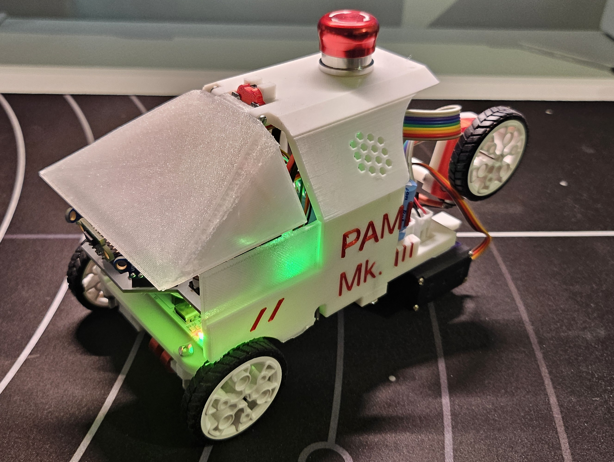
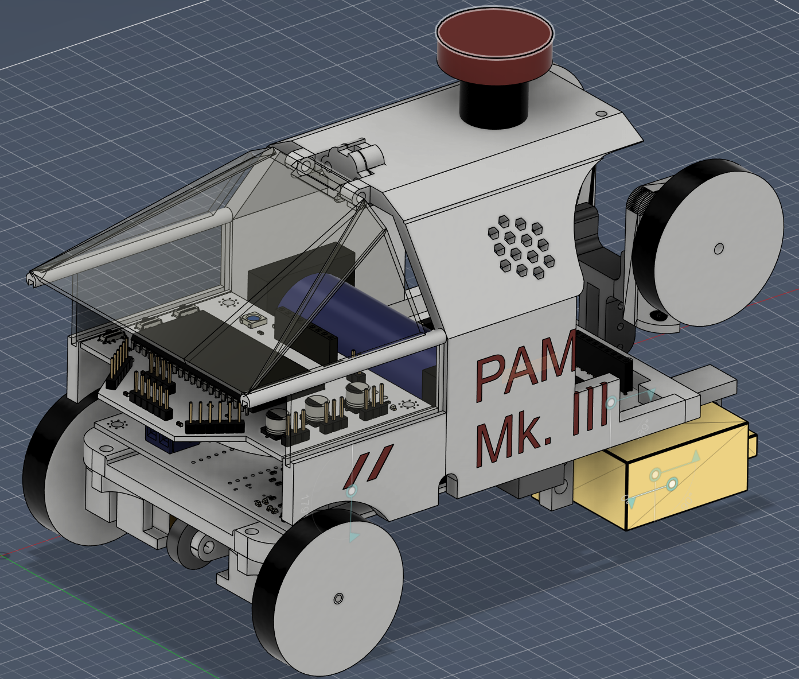
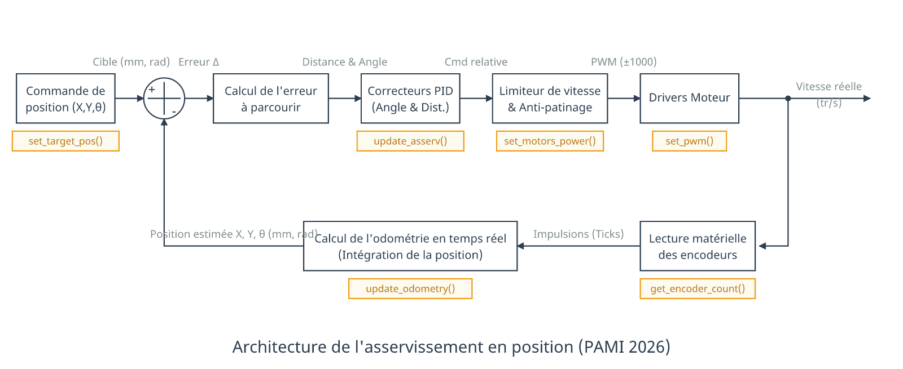
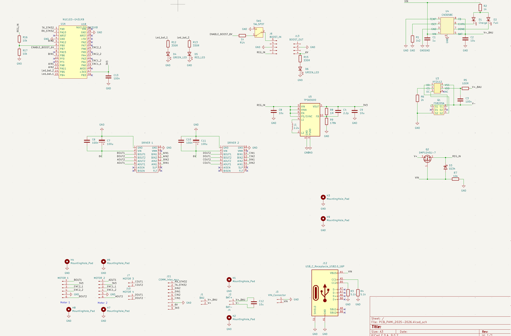

# Projet PAMI (2025-2026) - Eurobot

Ce dépôt documente le projet PAMI (Petit Actionneur Motorisé Indépendant) sur lequel j'ai travaillé pendant un an, dans le cadre de la coupe Eurobot 2026. Il centralise l'ensemble de la conception matérielle (deux PCB, structure mécanique) et logicielle du robot. 

  
   
  <em>Légende : Photo du robot PAMI assemblé</em>

  
   
  <em>Légende : Rendu 3D du robot (Fusion 360)</em>

## Codes principaux

Pour mieux comprendre l'architecture du système, voici les trois éléments importants du dépôt :

*   **[`PAMI_2026/`](./Projects/PAMI_2026)** : Contient le code haut niveau qui est exécuté sur le microcontrôleur **ESP32**.
*   **[`Projects/Asservissement_G4/`](./Projects/Asservissement_G4)** : Contient tout le code de l'asservissement, de l'odométrie et le contrôle des moteurs. Ce code tourne sur la carte **NUCLEO-G431KB** (STM32).
*   **[`Projects/IHM_PAMI_2026.py`](./Projects/IHM_PAMI_2026.py)** : Une interface homme-machine (IHM) développée en Python qui permet de lire et visualiser en temps réel les coordonnées et l'état du PAMI lors des phases de tests.

---

## Architecture Bas Niveau : PCB Principal (Contrôle Moteurs & Alimentation)

Le robot dispose de deux cartes électroniques (PCB). La partie bas niveau, gérée par le PCB principal s'occupe de l'alimentation générale et de la motricité du robot. Le PAMI est assez compact : ses dimensions finales sont de 10.5cm par 19cm avec ses bras repliés (et 24cm bras dépliés), ce qui a imposé des contraintes sur le routage du circuit et le choix des composants.

### 1. Gestion de la Batterie et Alimentation
Le robot est alimenté par une unique cellule de batterie au format 26650. 

*   **Le choix du LiFePO4 :** Bien que l'intégration de cette chimie ait rendu la conception du circuit d'alimentation plus complexe (notamment pour la régulation de tension, le prix plus élevé), c'est un choix qui reste très avantageux. Le LiFePO4 est extrêmement sécurisé (aucun risque d'incendie, pas besoin de sac ignifugé contrairement aux batteries LiPo), il offre un excellent courant de décharge (15A) pour les moteurs, et l'utilisation d'une seule et unique cellule simplifie grandement le processus de charge (pas d'équilibrage entre deux cellules nécessaire).
*   **Port USB C intégré :** Pour une simplicité d'usage maximale, un port USB C standard a été intégré au design, permettant de recharger facilement la batterie avec n'importe quel chargeur ou batterie externe.

Le circuit d'alimentation a subi plusieurs modifications suite à des problèmes rencontrés lors du développement :

*   **Circuit de Charge :** La charge est gérée directement sur le PCB par un composant dédié à ce type de batterie, le **CN3058E**, avec des LEDs indicatrices (Charge en cours / Charge terminée).
*   **Sécurité Batterie :** La batterie est surveillée par un IC de protection **HY2112**, associé à un double MOSFET N-Channel (FS8205A) pour couper le circuit en cas de problème.
*   **Régulation de tension :** La tension de la cellule LiFePO4 pouvant monter à 3.6V (ce qui est trop élevé pour l'ESP32 et certains capteurs), j'ai opté pour un convertisseur **Buck-Boost (TPS63000)** au lieu d'un simple circuit Boost. Il assure un 3.3V parfaitement stable en abaissant ou élevant la tension de la batterie selon les besoins, pour un courant jusqu'à 1A.
*   **Le problème des appels de courant :** Un problème est survenu avec l'alimentation des servomoteurs. Leurs appels de courant créaient d'énormes chutes de tension (la tension de la batterie chutait jusqu'à 2.4V pendant un court instant). Le robot ne parvenait pas à se lever de manière autonome, la tension de la batterie passait en dessous du seuil limite du circuit boost 6V. La cause : la résistance interne du boitier de la batterie 26650 et des pistes de cuivre trop fines (1.5mm) qui ne supportaient pas les pics d'intensité très élevés (pouvant monter jusqu'à 3A sur le rail 6V, soit quasiment 6A en sortie de la batterie). Le problème a été résolu en soudant un condensateur de 2200µF (10V) directement à l'entrée du boost 6V pour agir comme une réserve d'énergie, ce qui diminuait fortement la chute de tension.

### 2. Odométrie et Asservissement (NUCLEO-G431KB)
La carte intègre un microcontrôleur STM32 (NUCLEO-G431KB) programmé en C++ pour gérer la dynamique temps-réel du robot. Un travail conséquent a été réalisé sur la fiabilité des déplacements et la prévention du patinage.

*   **Odométrie Haute Fréquence (500Hz) :** La position exacte du robot (X, Y, Angle) est calculée 500 fois par seconde. Les encodeurs incrémentiels des roues renvoient des signaux en quadrature décodés de manière purement matérielle par les Timers du STM32. Le code gère les débordements de compteurs (overflow des timers 16 bits) pour assurer un suivi sans erreur.
*   **Asservissement PID en 2 Phases (100Hz) :** Le contrôle de la trajectoire s'effectue via une boucle PID (Proportionnel, Intégral, Dérivé) actualisée à 100Hz. Pour rejoindre une cible, l'algorithme utilise une logique en deux temps :
    1. **Rotation pure :** Le robot pivote sur lui-même pour s'aligner parfaitement vers sa cible.
    2. **Avance avec correction :** Une fois aligné, il avance en ligne droite tout en maintenant son angle de manière active. Si le robot doit dévier fortement, la commande linéaire est automatiquement réduite pour privilégier la rotation et garder un mouvement fluide.
*   **Traction Control & Anti-Patinage :** Les robots de la coupe Eurobot sont sujets au patinage (poussière, accélération forte), ce qui fausse instantanément l'odométrie. J'ai donc un algorithme de détection de glissement : si la différence de vitesse mesurée entre la roue gauche et droite devient anormalement élevée, le STM32 détecte la perte d'adhérence et réduit la commande PWM envoyée aux moteurs.
*   **Performances :** À pleine vitesse, les moteurs tournent à environ 5 tours/seconde, propulsant le PAMI à 68 cm/s (2.4 km/h). La dérive odométrique pure a été mesurée à environ 2cm d'erreur pour 1 mètre parcouru en ligne droite.
*   **Communication Inter-Cartes :** Le STM32 transmet continuellement ses données d'odométrie et son état au cerveau central (l'ESP32) via une liaison série (UART), dont le protocole est détaillé dans `pami_com.h`.

  
   
  <em>Légende : Schéma de l'architecture d'asservissement du STM32.</em>

### Schématique du PCB Principal

Voici la schématique électrique du PCB principal (Moteurs & Alimentation) montrant l'interconnexion entre la NUCLEO, les drivers moteurs, le circuit de charge de la batterie et le régulateur Buck-Boost :

  
   
  <em>Légende : Schématique détaillée du PCB d'alimentation</em>

  
   
  <em>Légende : Routage du PCB d'alimentation</em>

## Architecture Haut Niveau : Capteurs et Stratégie (ESP32)

La seconde carte du robot embarque un **ESP32**. Ce microcontrôleur fait office de cerveau principal : il ne gère aucun moteur directement, mais s'occupe de la prise de décision, de la vision spatiale (capteurs ToF matriciels), de la gestion du temps de match et de l'interface utilisateur.

### 1. Multitâche avec FreeRTOS
Pour garantir une réactivité maximale sans bloquer le système lors de la lecture des capteurs I2C (qui peut être lente), le code de l'ESP32 est architecturé autour du système d'exploitation temps réel **FreeRTOS**. Les tâches sont réparties sur les deux cœurs (Cores) physiques du processeur :

*   **Core 1 (Haute Priorité) :** 
    *   `Task_Comms` : Écoute en continu le port série UART pour ne rater aucune mise à jour de position venant du STM32. Permet aussi le debug lorsque branché à un PC.
    *   `Task_Strategy` : La machine à états principale du robot. Elle dicte les déplacements et gère le chronomètre du match.
*   **Core 0 (Basse Priorité) :**
    *   `Task_Tofs` : Gère le multiplexage et l'acquisition des données des 3 capteurs de distance matriciels sur le bus I2C.
    *   `Task_IHM` : Contrôle les animations de la LED d'état WS2812B et pilote les servomoteurs d'actionnement de fin de match.

### 2. Vision Spatiale : Capteurs ToF (VL53L5CX) et Anti-Collision
Le robot est équipé de 3 capteurs Time-of-Flight matriciels **VL53L5CX** (Centre, Gauche, Droite) configurés en résolution 8x8 zones à 15 Hz.

*  L'ESP32 configure dynamiquement les adresses I2C des 3 capteurs au démarrage (vers `0x30`, `0x31`, `0x32`) en utilisant les broches `XSHUT` (LPN), ce qui permet de tous les utiliser sur le même bus I2C à 400kHz.
*   **Calcul de repère absolu :** Lorsqu'un capteur détecte un obstacle, la tâche ne se contente pas de renvoyer une distance. Elle utilise la position instantanée du robot (X, Y, θ) et la géométrie des capteurs (FOV de 45°/60°, offset physique en X/Y) pour projeter l'obstacle sur le système de coordonnées du terrain. Le robot sait exactement où se trouve l'obstacle sur la table.
*   **Évitement d'urgence :** Si un objet est détecté à moins de 10 cm dans les zones critiques, le STM32 reçoit instantanément un ordre d'arrêt (`stopMotors()`) via l'UART. Le robot se met en pause et reprend sa route de lui-même dès que l'obstacle disparaît.

### 3. Stratégie et Machine à États
La logique de match est dictée par une machine à états :

1.  **`STATE_WAIT` (Attente) :** L'ESP32 lit la couleur de l'équipe via un switch (`PIN_SW_COLOR`). L'ensemble du système de coordonnées (points de départ, waypoints, cibles) est automatiquement symétrisée (inversion de l'axe X) si le robot est dans l'équipe bleue. Le robot attend le retrait de la tirette, en affichant la couleur du terrain sur la led d'IHM.
2.  **`STATE_DELAY` (Attente 85s) :** Selon les règles, les PAMI ne peuvent entrer en action qu'à la fin du match principal. Au retrait de la tirette, le robot reset son odométrie (`resetSTM32`) puis attend pendant 85 secondes.
3.  **`STATE_GAME` (Match) :** L'ESP32 commence à lire sa route de Waypoints et envoie les coordonnées cibles au STM32. Si un obstacle fixe est détecté lors du premier déplacement, un waypoint bonus est généré dynamiquement pour modifier la stratégie en cours de match.
4.  **`STATE_END` (Fin de match) :** À T+99s, le robot stoppe ses moteurs et déploie ses bras à l'aide de ses servomoteurs.

### 4. Communication Inter-Cartes et IHM
*   **Protocole UART :** L'ESP32 et le STM32 communiquent à 115200 bauds. Le STM32 "stream" en continu ses coordonnées au format `X:123,Y:456,Z:1.57`, que l'ESP32 parse via la fonction `parseSTM32Data`. En retour, l'ESP32 envoie des commandes simples au STM32 (`mode auto`, `stop`, `X:1000`, `reset:x:y:z`).
*   **Feedback Visuel (LED WS2812B) :** Sans écran, le debug visuel repose principalement sur la LED RGB adressable intelligente. Sa couleur et son rythme de clignotement indiquent instantanément l'état du système : 
    *   *Rouge fixe* : Batterie LiFePO4 faible.
    *   *Orange clignotant* : Obstacle détecté par ToF.
    *   *Vert clignotant* : Tirette retirée, en cours d'attente (85s).
    *   *Vert fixe* : Match en cours.
    *   *Jaune/Bleu* : Robot en attente de la tirette, affiche la couleur de l'équipe sélectionnée.

    ## Conclusion et Démonstration en Match

Après de nombreuses itérations matérielles (sur les deux itérations de PCB et la mécanique) ainsi qu'un gros travail d'optimisation logicielle, le PAMI a su remplir son rôle de manière fiable et concluante.

Voici une courte vidéo démontrant son fonctionnement lors d'un match (cas le plus simple, sans obstacles) :

  <video src="./video_match.mp4" width="80%" controls="controls"></video>

